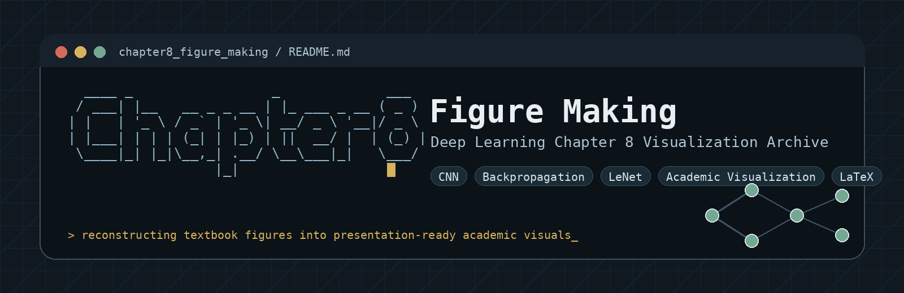

  

---

A reconstruction and redesign project for Chapter 8 deep learning figures, focused on modern academic visualization, low-saturation scientific aesthetics, and presentation-ready educational materials.

This repository contains redesigned figures, slide assets, and LaTeX-related resources for explaining the historical evolution and architectural development of deep learning systems, especially convolutional neural networks (CNNs).

---

## Design Principles

This project follows several design principles:

1. Information-first visualization
2. Academic presentation compatibility
3. Consistent typography and spacing
4. Reduced visual clutter
5. Modern conference-style figure aesthetics

Recommended font:

- MiSans

Recommended usage scenarios:

- teaching slides
- conference presentations
- lecture notes
- educational videos
- academic blogs

---

## Tools

Possible tools used in this project include:

- PowerPoint
- LaTeX
- Adobe Illustrator
- Figma
- Python visualization libraries
- GitHub for version management

---

## Notes

Most figures are reconstructed for educational and research communication purposes.

Some historical images or references may originate from public academic materials, textbooks, or research papers.

---

## Future Plans

- Complete Chapter 8 full reconstruction
- Add editable vector assets
- Add bilingual annotations
- Add animation-ready slide structures
- Export publication-ready PDF assets
- Improve repository modularization
---

---

---
